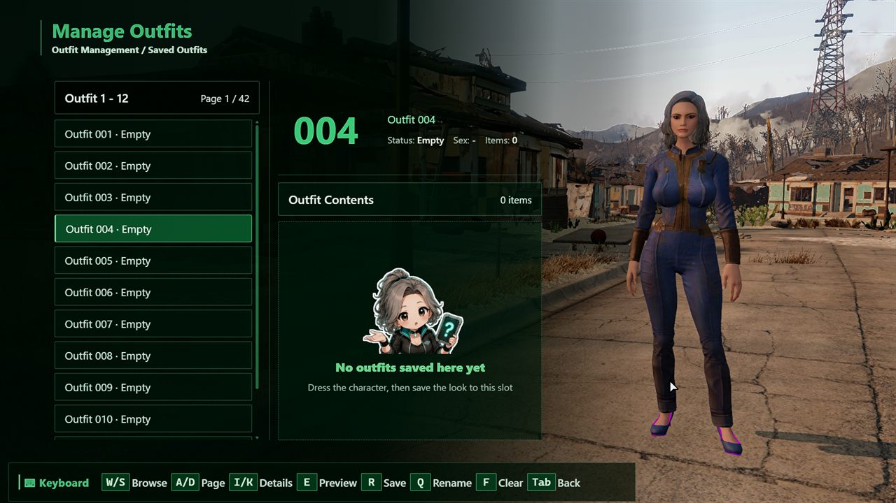

# Fallout 4 Aozora Outfit System

> 青空的服装管理系统：面向 Fallout 4 的套装保存、预览、材质交换与玩家/NPC 换装工具
>
> A native Fallout 4 F4SE outfit management system for saving, previewing, material workflows, and player/NPC outfit changes.

暂时不支持最新的 Fallout 4 AE 版本（1.11.240）。
The latest Fallout 4 AE version (1.11.240) is not supported at this time.

[OUTFIT] Outfit Slots · [PREVIEW] Outfit Studio · [MATERIAL] Material Swap · [NPC] Player/NPC · [INPUT] Keyboard/Gamepad

## 中文

Aozora Outfit Management System 2.0.5 是由 Fallout4 Outfit Manager 全面升级而来的稳定版服装管理系统。

项目包含 F4SE 原生插件、Papyrus 接口、Prisma UI 页面、MCM 配置和独立的中英文源码目录。

### 主要功能

标记 | 功能
--- | ---
[ SLOT ] | 支持 500 个套装槽位，可保存、命名、清空、还原并切换上一套或下一套
[ PREVIEW ] | 在玩家或符合条件的 NPC 身上预览套装，确认后才会正式换装
[ STUDIO ] | 服装工作台默认关闭，可在 MCM 高级选项中开启
[ MATERIAL ] | 主要支持使用 MSWP 记录的 MOD 服装材质交换与永久物品生成
[ OMOD ] | 只要改装最终表现为基础物品加 OMOD 数据，就可以尝试保存和还原
[ NPC ] | 支持玩家和符合条件的人形 NPC；仅过滤不支持穿衣的动物、怪物与机器人
[ WEAPON ] | 可在 MCM 中单独开启武器保存，记录普通改装和传奇效果
[ INPUT ] | 支持键盘和手柄；稳定版暂不启用鼠标操作
[ LAYOUT ] | 提供 16:9 与 16:10 基准布局，21:9 沿用 16:9 高度缩放逻辑

### 兼容范围

材质交换功能主要面向通过 MSWP 记录提供材质变体的 MOD 服装。

工作台或第三方系统的改装，只要最后是基础物品加 OMOD 数据，系统就可以尝试保存和还原。

脚本驱动的改装、独立运行时数据和超出基础物品加 OMOD 范围的效果，无法保证正确还原。

武器保存会保留普通改装和传奇效果，可识别的 Fallout4.esm 独特或特殊效果会按照稳定版规则过滤。

### 前置要求

- Fallout 4
- 与游戏版本匹配的 Fallout 4 Script Extender（F4SE）
- Address Library for F4SE Plugins
- Mod Configuration Menu（MCM）
- Prisma UI Framework 2.0.3 或兼容的后续 2.x 版本
- Garden of Eden Papyrus Script Extender（GOE）

### 仓库结构

~~~text
CHS/2.0.5/      中文源码、Papyrus、UI 和 MCM 配置
EN/2.0.5/       English source, Papyrus, UI, and MCM configuration
tools/           UI 检查、布局验证和资源处理工具
docs/            构建说明与稳定版范围说明
~~~

### 构建

原生插件使用 xmake.lua 和 CommonLibF4 构建，请从 CHS/2.0.5/Native 或 EN/2.0.5/Native 目录选择对应语言版本。

Papyrus 源码位于对应语言的 Papyrus/Source/User 目录，需要使用 Caprica 或兼容的 Fallout 4 Papyrus 编译器单独编译。

生成的 DLL、PEX、ESP、OBJ、LIB、编译缓存和发布专用辐射娘素材不包含在源码仓库中。

更多构建说明见 [docs/BUILD.md](docs/BUILD.md)。

## English

Aozora Outfit Management System 2.0.5 is the stable full upgrade of Fallout4 Outfit Manager.

The repository contains the native F4SE plugin source, Papyrus bindings, Prisma UI pages, MCM configuration, and separate CHS/EN source directories.

### Features

Marker | Feature
--- | ---
[ SLOT ] | Up to 500 outfit slots with save, rename, clear, restore, previous, and next actions
[ PREVIEW ] | Preview outfits on the player or eligible NPCs before confirming the change
[ STUDIO ] | Disabled by default; enable Outfit Studio under MCM Advanced Options when needed
[ MATERIAL ] | Material Swap preview and permanent item generation primarily for mod clothing using MSWP records
[ OMOD ] | Workbench or third-party modifications can be restored when their final state is a base item plus OMOD data
[ NPC ] | Player and eligible humanoid NPC management with only non-wearable animals, creatures, and robots filtered out
[ WEAPON ] | Optional MCM weapon saving with standard modifications and legendary effects
[ INPUT ] | Keyboard and gamepad support; mouse input is intentionally disabled in the stable release
[ LAYOUT ] | Dedicated 16:9 and 16:10 baselines, with 21:9 reusing the 16:9 height scaling

### Compatibility

Material Swap is primarily designed for mod clothing that exposes material variants through MSWP records.

Workbench or third-party modifications can be restored when the final item is represented by a base item plus OMOD data.

Script-driven changes, custom runtime data, and effects outside the base-item-plus-OMOD model cannot be guaranteed to restore correctly.

Weapon saving retains standard modifications and legendary effects, while recognizable unique or special Fallout4.esm effects are filtered according to the stable release rules.

### Requirements

- Fallout 4
- Fallout 4 Script Extender (F4SE) matching the installed game runtime
- Address Library for F4SE Plugins
- Mod Configuration Menu (MCM)
- Prisma UI Framework 2.0.3 or a compatible later 2.x version
- Garden of Eden Papyrus Script Extender (GOE)

### Repository Structure

~~~text
CHS/2.0.5/      Chinese source, Papyrus, UI, and MCM configuration
EN/2.0.5/       English source, Papyrus, UI, and MCM configuration
tools/           UI checks, layout validation, and asset utilities
docs/            Build instructions and stable release scope
~~~

### Build

Build the native plugin with xmake.lua and CommonLibF4 from either CHS/2.0.5/Native or EN/2.0.5/Native.

Compile the Papyrus sources under the selected language's Papyrus/Source/User directory with Caprica or a compatible Fallout 4 Papyrus compiler.

Generated DLL, PEX, ESP, OBJ, LIB, build caches, and release-only mascot assets are intentionally excluded from this source repository.

See [docs/BUILD.md](docs/BUILD.md) for the build workflow.

## Screenshots / 界面预览

### Main Page / 主页面

### Outfit Management / 套装管理

### Outfit Studio / 服装工作台

### MCM General Settings / MCM 通用设置

## License / 许可

This project is released under the Aozora Outfit System Non-Commercial License.

本项目采用《青空服装管理系统非商业许可》发布。

Allowed without separate permission / 无需单独许可 | Requires prior permission / 需要事先许可
--- | ---
Personal use, modification, and private builds / 个人使用、修改和私有构建 | Commercial use or monetized distribution / 商业使用或商业化分发
Public or private forks / 公开或私有分支 | Paid mod packs or paid bundling / 付费整合包或付费打包
Non-commercial patches and mod packs / 非商业补丁和整合包 | Paid support or commissioned maintenance / 付费支持或有偿维护
Redistribution of modified or compiled builds / 修改版或编译版再发布 | Selling modified or compiled versions / 销售修改版或编译版

Please retain the original author and repository attribution, include a copy of LICENSE.md, and clearly mark substantial changes in derivative versions.

请保留原作者与仓库来源说明，附带 LICENSE.md，并在衍生版本中明确标注重要改动。

The software is provided as-is, without warranty. The author is not responsible for problems caused by modified builds or third-party redistribution.

本项目按“现状”提供，不提供任何保证。修改版或第三方再分发造成的问题，由使用者和再发布者自行负责。

See [LICENSE.md](LICENSE.md) for the complete bilingual license text.

完整的双语许可条款请参阅 [LICENSE.md](LICENSE.md)。
