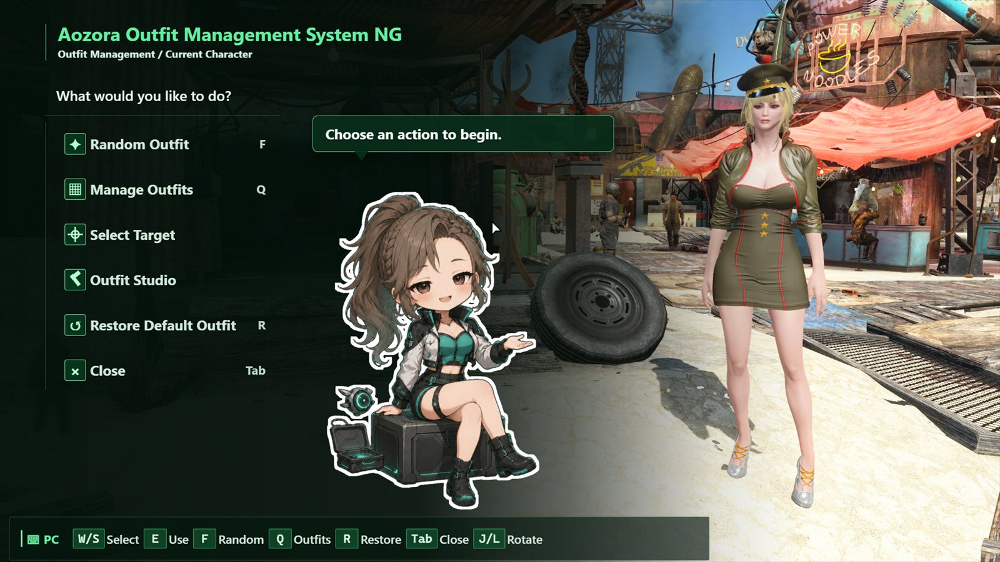
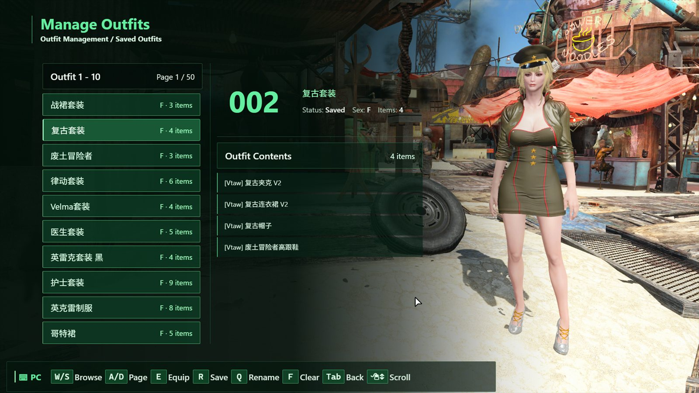
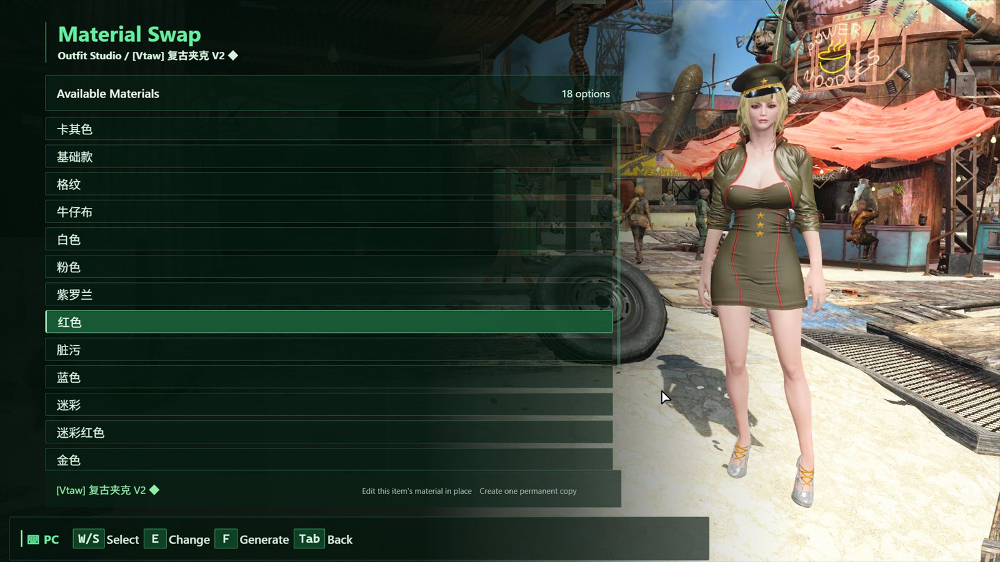
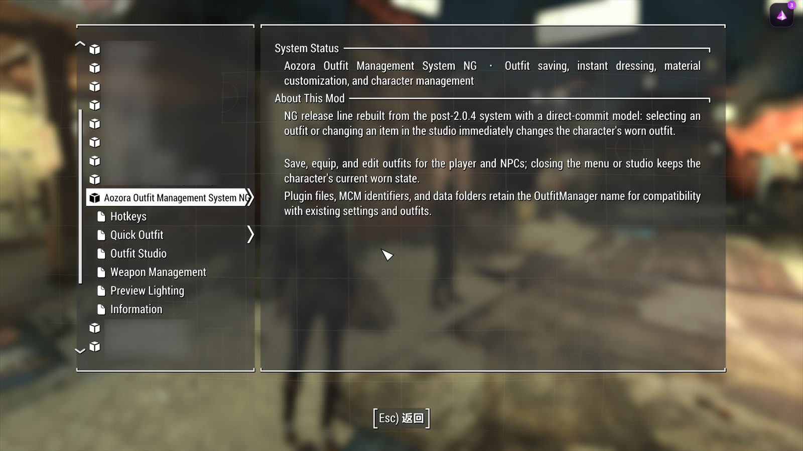
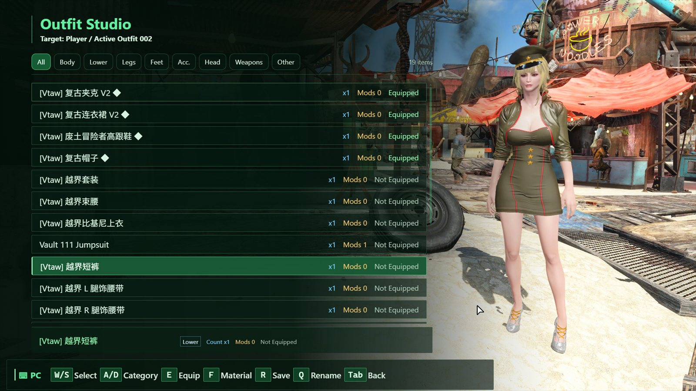
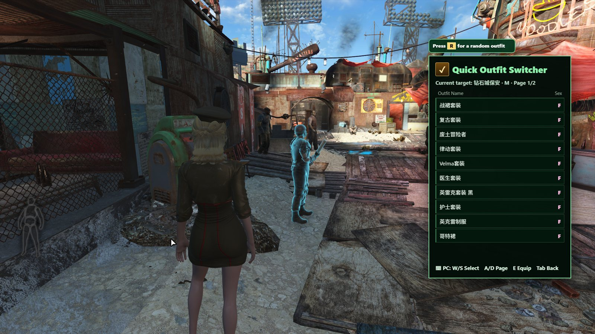
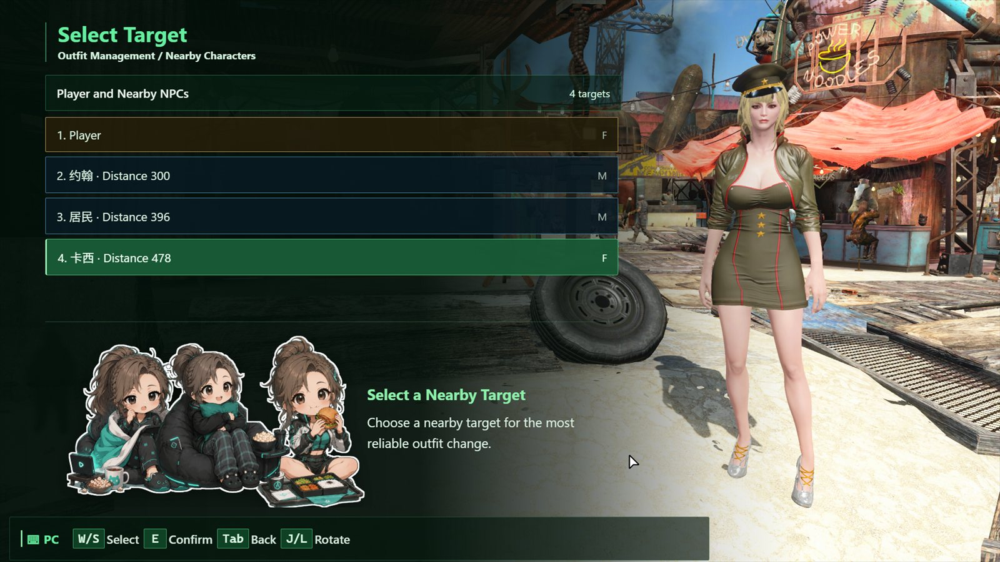

# Fallout 4 Aozora Outfit System NG

## 中文说明

### 项目简介

青空服装管理系统 NG 是 Fallout 4 Aozora Outfit System 的次世代版本。
本版本从原有版本出发进行了大量重构和更新，当前正式版本为 **NG 1.1.2**。

项目对外名称升级为 NG，但为了保留已有套装数据和配置的兼容性，游戏内的
插件、脚本、MCM 和数据目录标识仍保持为 OutfitManager。

### 更新重点

1. **兼容 AE 1.11.240**：原生插件已经完成对应的构建适配。使用时必须安装
   与当前游戏运行时完全匹配的 F4SE、Address Library、Prisma UI、MCM 和 GOE。
2. **操作大幅简化**：加入鼠标点击、悬停和滚动支持，并统一键盘、鼠标和手柄
   的焦点逻辑。键盘或手柄操作会接管鼠标焦点，只有鼠标再次移动到界面区域时
   才返回鼠标焦点。
3. **PrismaUI 2.1 适配**：针对进程内 Ultralight 1.4、受限 JS 队列、CPU 合成和
   held-frame 生命周期重做 UI 数据通道、首次焦点、页面存活和关闭流程。
4. **性能优化**：减少重复 DOM 更新、无效刷新和不必要的资源复制，保护异步
   状态更新，同时保留长列表在小屏幕下所需的滚动能力。
5. **光照重做**：重新整理角色预览使用的临时世界光照，室内和室外分别提供
   MCM 调节项，预览结束后会清理临时光照引用。
6. **NPC 换装持久化**：NPC 在快速旅行后重新载入场景时，会自动检查并恢复
   最近应用的套装，避免服装回到原版。
7. **队友换装**：成为队友后，系统会把带有完整改造数据的服装加入队友背包，
   不强制自动装备；玩家通过原版交易界面手动装备，避免队友装备评级导致裸体或闪烁。

### 主要功能

- 保存、命名、清除、还原和切换最多 500 套服装。
- 快速换装与套装管理支持键盘、鼠标和手柄，并保留必要的分页功能。
- 工作台可以管理当前穿着的服装、装备或卸下物品，以及交换材质。
- 材质可以预览，也可以保存为带有独立名称的材质版本。
- 支持玩家和符合条件的人形 NPC。
- 服装名称在确实发生截断时才会滚动显示，避免普通短名称产生无意义动画。
- 16:9 和 16:10 布局针对常见分辨率优化；1080p 优先完整显示 10 项，小屏幕
  在空间不足时自动保留滚动能力。

### 适用版本与验证范围

- 理论上支持 Fallout 4 OG 和 AE 的全部版本。
- 目前仅测试了 OG 和 AE 1.11.240。
- 由于个人开发者的人力和时间有限，其他版本未逐一测试；如果遇到兼容性问题，
  本模组已开源，欢迎自行修改、适配并上传。

### 前置要求

- 与游戏运行时匹配的 F4SE。
- 与游戏运行时匹配的 Address Library for F4SE Plugins。
- Prisma UI Framework 2.1.0 或更新版本；旧 PrismaUI 2.0.6 请使用 NG 1.0.2。
- Mod Configuration Menu（MCM）。
- Garden of Eden Papyrus Script Extender（GOE）。

不要混用 1.10.x 和 1.11.x 的前置文件。CHS 和 EN 的程序结构一致，只能安装
一个语言包，也不要与旧版 OutfitManager 同时启用。

### 安装

1. 安装全部与当前 Fallout 4 运行时匹配的前置。
2. 在 MO2 中安装 Aozora_Outfit_Management_System_NG_1.1.2_CHS.7z 或
   Aozora_Outfit_Management_System_NG_1.1.2_EN.7z。
3. 只选择一个语言版本，并确认它位于相关框架之后。
4. 启动游戏后确认 MCM 已加载，再使用快捷键或工作台入口。

### 数据兼容标识

以下标识保持不变，用于兼容已有套装数据和配置：

- 插件：OutfitManager.esp
- 原生插件：OutfitManager.dll
- Papyrus 脚本：OutfitManager、OMNative 及控制器脚本
- MCM 标识和设置路径：OutfitManager
- 套装数据目录：F4SE/Plugins/OutfitManager

### 仓库结构

~~~text
EN/1.1.0/      英文原生插件、Papyrus、UI 和 MCM 源码
CHS/1.1.0/     简体中文原生插件、Papyrus、UI 和 MCM 源码
EN/1.0.2/      旧版回滚源码
CHS/1.0.2/     旧版回滚源码
docs/           构建说明、发布范围和 README 图片
tools/          源码验证及素材处理工具
~~~

源码仓库不提交编译生成的 DLL、PEX、ESP、构建缓存和日志。可直接安装的 CHS/EN
压缩包作为独立 Release 产物维护。

### 构建

原生插件使用 x64 Visual Studio 工具链与 CommonLibF4 构建。进入对应语言的
Native 目录后执行：

~~~powershell
xmake build -y
~~~

Papyrus 源码位于 Papyrus/Source/User，使用 Caprica 或兼容的 Fallout 4
Papyrus 编译器编译。完整的源码、构建和打包流程见
[docs/BUILD.md](docs/BUILD.md)。

### 界面预览

### 许可证

本项目使用 [Aozora Outfit Management System NG Non-Commercial License](LICENSE.md)。
该许可证允许个人非商业使用、修改和再发布，但未经许可不得用于商业用途。

## English

### Introduction

Aozora Outfit System NG is the next-generation version of Fallout 4 Aozora
Outfit System. It contains a large-scale refactor and extensive updates over
   the previous version. The current stable release is **NG 1.1.2**.

The public product name is now NG. For compatibility with existing outfit data
and settings, the in-game plugin, scripts, MCM identifiers, and data directory
still use OutfitManager.

### Update Highlights

1. **PrismaUI 2.1 support**: the native and HTML layers are adapted for the
   in-process Ultralight 1.4 runtime, JSON `InteropCall` delivery, bounded view
   lifecycle, and first-focus recovery. Use NG 1.0.2 as the rollback package for
   PrismaUI 2.0.6.
2. **AE 1.11.240 support**: the native plugin has been adapted and built for
   the runtime. Install F4SE, Address Library, Prisma UI, MCM, and GOE versions
   that exactly match the installed game runtime.
3. **Simpler controls**: mouse click, hover, and scrolling are supported, with
   one focus model shared by keyboard, mouse, and gamepad. Keyboard or gamepad
   input takes over from the mouse, and mouse focus returns only after the
   cursor moves over the interface again.
4. **UI performance improvements**: redundant DOM updates, invalid redraws, and
   unnecessary asset duplication are reduced. Asynchronous state updates are
   guarded, while scrolling remains available when a smaller screen needs it.
5. **Rebuilt lighting**: character preview lighting has been reorganized using
   temporary world-light references. Indoor and outdoor controls are separate
   and adjustable in MCM, and temporary references are cleaned up afterward.
6. **Persistent NPC outfits**: when an NPC's cell is reattached or fully loaded
   after fast travel, the last applied saved outfit is checked and restored
   instead of allowing the vanilla outfit to replace it.
7. **Companion outfits**: after recruitment, the manager adds the complete
   modified outfit instance to the companion's inventory without force-equipping
   it. Equip it manually through the vanilla trade menu to avoid companion
   equipment-rating conflicts.

### Main Features

- Save, rename, clear, restore, and switch up to 500 outfits.
- Use keyboard, mouse, or gamepad for quick outfit switching and outfit
  management, with paging retained where it is needed.
- Manage the current worn outfit in the workbench, equip or unequip items, and
  swap materials.
- Preview materials and save named material variants.
- Support the player and eligible humanoid NPCs.
- Scroll a clothing name only when it is actually truncated; ordinary short
  names do not receive unnecessary scrolling animation.
- Optimized 16:9 and 16:10 layouts prioritize ten visible entries at 1080p,
  while smaller screens retain scrolling when space is insufficient.

### Supported Versions and Verification Scope

- Theoretically supports all Fallout 4 OG and AE versions.
- Currently tested only on OG and AE 1.11.240.
- Due to the limited time and resources of an individual developer, other
  versions are not individually tested. If you encounter compatibility issues,
  this mod is open source and you are free to modify, adapt, and upload your
  own compatible version.

### Requirements
- F4SE matching the installed runtime.
- Address Library for F4SE Plugins matching the installed runtime.
- Prisma UI Framework 2.1.0 or newer. For PrismaUI 2.0.6 use NG 1.0.2.
- Mod Configuration Menu (MCM).
- Garden of Eden Papyrus Script Extender (GOE).

Do not mix 1.10.x and 1.11.x prerequisites. CHS and EN share the same program
structure; install only one language package and do not enable an older
OutfitManager package alongside NG.

### Installation

1. Install all prerequisites matching the current Fallout 4 runtime.
2. Install Aozora_Outfit_Management_System_NG_1.1.2_CHS.7z or
   Aozora_Outfit_Management_System_NG_1.1.2_EN.7z through MO2.
3. Choose one language package and place it after the required frameworks.
4. Start the game, confirm that MCM has loaded, then use the hotkeys or
   workbench entry points.

### Data Compatibility Identifiers

The following identifiers remain unchanged so existing outfit data and settings
can continue to work:

- Plugin: OutfitManager.esp
- Native plugin: OutfitManager.dll
- Papyrus scripts: OutfitManager, OMNative, and controller scripts
- MCM identifiers and settings paths: OutfitManager
- Outfit data directory: F4SE/Plugins/OutfitManager

### Repository Layout

~~~text
EN/1.1.0/      English native plugin, Papyrus, UI, and MCM source
CHS/1.1.0/     Simplified Chinese native plugin, Papyrus, UI, and MCM source
EN/1.0.2/      Previous rollback source
CHS/1.0.2/     Previous rollback source
docs/           Build notes, release scope, and README screenshots
tools/          Source validation and asset-processing utilities
~~~

The source repository does not track generated DLL, PEX, ESP, build caches, or
logs. Ready-to-install CHS/EN archives are maintained as separate Release
artifacts.

### Build

The native plugin uses the x64 Visual Studio toolchain and CommonLibF4. From the
selected language's Native directory, run:

~~~powershell
xmake build -y
~~~

Papyrus sources are under Papyrus/Source/User; compile them with Caprica or
another compatible Fallout 4 Papyrus compiler. See [docs/BUILD.md](docs/BUILD.md)
for the complete source, build, and packaging workflow.

### Screenshots

### License

This project is released under the [Aozora Outfit Management System NG
Non-Commercial License](LICENSE.md). Personal non-commercial use, modification,
and redistribution are allowed; commercial use requires permission.
